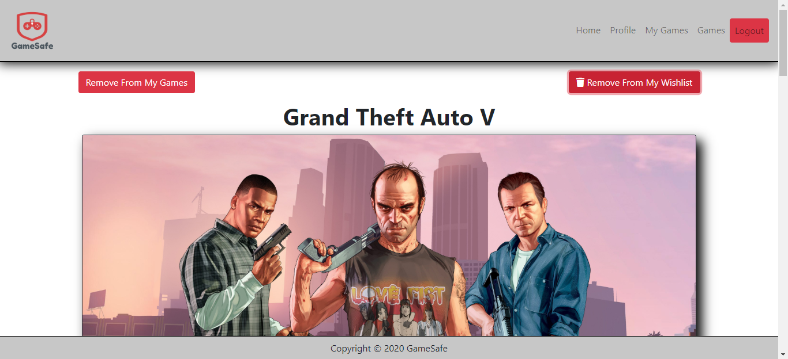

# GameSafe

## Description
GameSafe is a full CRUD website designed to save users game libraries. The site uses an external third-party API to retrieve thousands of games from PC to Xbox to even mobile games. This app allows the user to create a profile for themselves and add games to their profile. They can add games to their wishlist if they so choose to. Every game has its own page with all sorts of information about said game.
## Screenshots

### Login Page

This is the page you come to when you first get to the website.

This page shows up when you log in to the page.

### Profile Page

When you go to the profile page without having a profile, this page pops up.

Once the information is filled out the user will see all the information they had inputted.

### The Users Games

Here, all the games the user has added to their profile will show up.

From there you can add it and remove it to your wishlist. You can also delete the game from your vault entirely.

Here you can see that I added it to my wishlist.

Here you can see it even changed the wishlist button here on the specific card.

### Main Games Page

Here is the main games page.

Here you can see that I am searching for games using the API's immense database.

Here you can see the buttons will let you go through the API without having to type out a specific game.

Here you can see that when you already have a game in your vault, an alert will pop up.

Here you can see that if the game isn't in your vault, an alert pops up saying it's been added.

### Single View Page

Here is the entire page and all the information shown is given through the API.

The API sometimes brings back user ratings and here I showcase them through progress bars.

Here you can see all the places you can play the certain game.

## How To Run
1. Clone down this repo
1. Make sure you have http-server install via npm. If not get it [HERE](https://www.npmjs.com/package/http-server).
1. On your command line run `hs -p 9999`
1. In your browser go to `http://localhost:9999`

Or go to the Deployed link [Here](https://frontend-capstone-fe278.firebaseapp.com/)